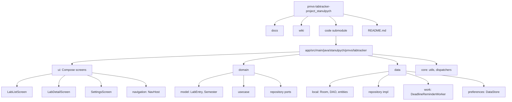

# Диаграмма структуры проекта

## Диаграмма

## Ключевые каталоги

| Путь | Назначение |
|------|------------|
| `docs/` | Документация для GitHub Pages |
| `wiki/` | Страницы для GitHub Wiki (импорт) |
| `code/` | Android-приложение (git submodule) |
| `code/.../ui` | Jetpack Compose, ViewModel |
| `code/.../domain` | Бизнес-правила, use case |
| `code/.../data` | Room, WorkManager, DataStore |
