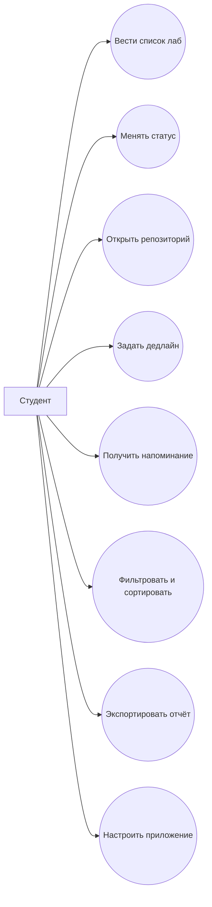

# Функциональные требования

## Основные требования

1. Пользователь может добавить запись о лабораторной работе (номер, название, ссылка).
2. Пользователь может удалить или архивировать запись.
3. Пользователь может назначить статус: запланировано / в работе / сдано.
4. Пользователь может фильтровать список по семестру или статусу.
5. Пользователь может открыть ссылку на репозиторий во внешнем браузере.
6. Пользователь может добавить текстовую заметку к лабораторной.
7. Пользователь может задать дату дедлайна и включить напоминание.
8. Пользователь может вручную обновить порядок сортировки (drag-and-drop).
9. Пользователь может экспортировать сводку прогресса в текстовый файл (Share).
10. Пользователь может выбрать тему интерфейса (светлая / тёмная / системная).
11. Пользователь может включить уведомления о приближающемся дедлайне.
12. Пользователь может включить режим «только Wi‑Fi» для фоновой проверки (опционально).

## Диаграмма Use Case

## Текстовые сценарии

### UC-01: Добавление лабораторной

- **Предусловие:** открыт экран списка.
- **Основной поток:**
  1. Нажимает «Добавить».
  2. Вводит номер ЛР, название, URL репозитория.
  3. Приложение сохраняет запись в Room.
  4. Карточка появляется в списке со статусом «запланировано».
- **Постусловие:** лабораторная доступна для редактирования и фильтрации.

### UC-02: Отметка прогресса

- **Предусловие:** в списке есть хотя бы одна лабораторная.
- **Основной поток:**
  1. Пользователь открывает карточку.
  2. Меняет статус на «в работе» или «сдано».
  3. При необходимости добавляет заметку.
  4. Приложение сохраняет `updated_at`.
- **Постусловие:** на главном экране обновляется индикатор прогресса семестра.

### UC-03: Напоминание о дедлайне

- **Предусловие:** для лабораторной указана дата защиты, уведомления разрешены.
- **Основной поток:**
  1. WorkManager планирует задачу за 24 часа до дедлайна.
  2. В момент срабатывания показывается уведомление.
  3. По нажатию открывается карточка лабораторной.
- **Постусловие:** студент видит актуальный статус и ссылку на репозиторий.
