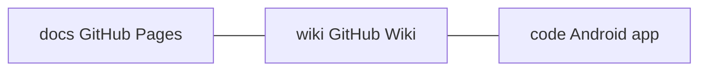

# Диаграмма структуры проекта

Полная версия: [file-diagram.md](../docs/file-diagram.md)

## Слои Android (`code`)

| Слой | Пакет | Ответственность |
|------|-------|----------------|
| UI | `...ui` | Compose, ViewModel |
| Domain | `...domain` | Use case, модели |
| Data | `...data` | Room, Worker, DataStore |

Отличие от «новостного» шаблона: нет Retrofit/NewsAPI — только локальные данные и опциональные внешние ссылки.
