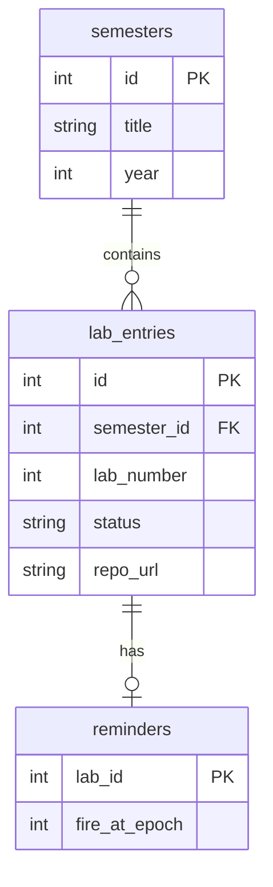

# Схема базы данных

SQL: [schema.sql](../docs/db/schema.sql)

## ER-диаграмма (логическая)

## Отличия от типового «новостного» проекта

- Вместо `subscriptions` / `articles` — **семестры** и **лабораторные**.
- Нет составного ключа по URL статьи — уникальность `(semester_id, lab_number)`.
