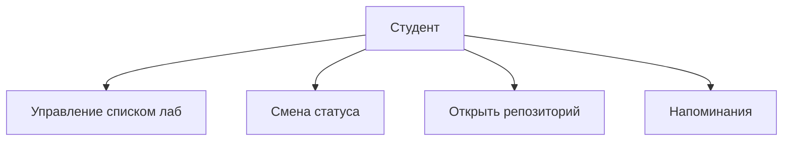

# Функциональные требования

См. также версию в docs: [functional-requirements.md](../docs/functional-requirements.md)

## Краткий список

1. CRUD записей о лабораторных работах.
2. Статусы: запланировано / в работе / сдано.
3. Фильтр по семестру и статусу.
4. Открытие URL репозитория в браузере.
5. Заметки к каждой лабораторной.
6. Дедлайн + локальное напоминание.
7. Экспорт текстовой сводки прогресса.
8. Тема UI и настройки уведомлений.

## Use Case (схема)

## Сценарий «Сдача лабораторной»

Студент меняет статус на **сдано**, добавляет ссылку на отчёт в заметку и экспортирует сводку для преподавателя.
